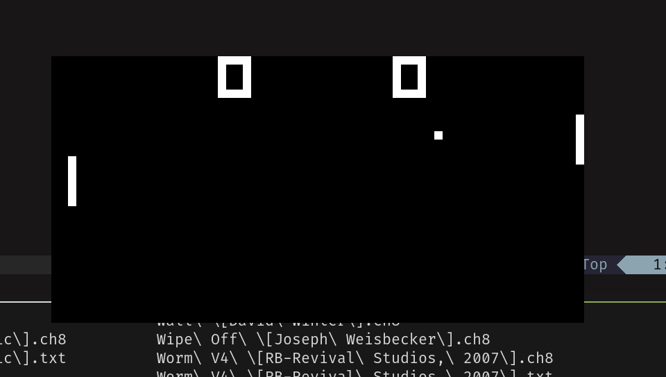
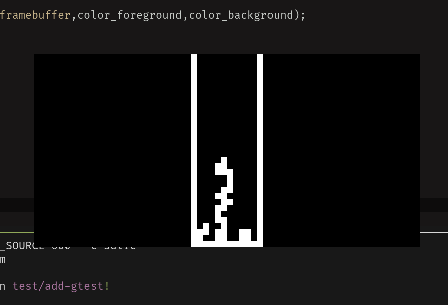
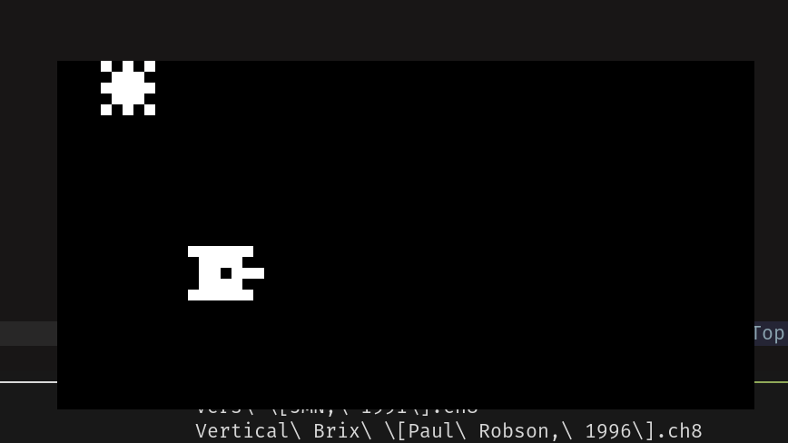

# CHIP-8 Emulator

This project is an implementation of a CHIP-8 emulator written in pure C.  
CHIP-8 is a virtual machine from the 1970s, often used as a starting point for emulator development.

## Features

- Full CHIP-8 CPU implementation
- 4KB memory model
- Opcode decoding and execution
- Input handling (keyboard)
- Graphics rendering (64x32 display) using SDL2
- Unit tests using Google Test (gtest)
- Containerized environment using Docker

<div align="center">
  
  
  
  <p><em>Chip-8 interpreter running classic ROMs: Ping Pong, Tetris, Tank</em></p>
</div>

## Requirements

- **SDL2** - Graphics and input handling
- **Google Test** - Unit testing framework
- **make** - Build automation
- **C compiler** (gcc/clang)

## Installation

### Install Dependencies

**Ubuntu/Debian:**
```bash
sudo apt install libsdl2-dev libgtest-dev cmake make gcc
```

**Fedora:**
```bash
sudo dnf install SDL2-devel gtest-devel cmake make gcc
```
**Arch:**
```bash
sudo pacman -S sdl2 gtest cmake make gcc
```


## Compile
```bash
make
sudo make install
```

After installation, you can run the emulator from anywhere:
```bash
chip8 path/to/rom.ch8
```
